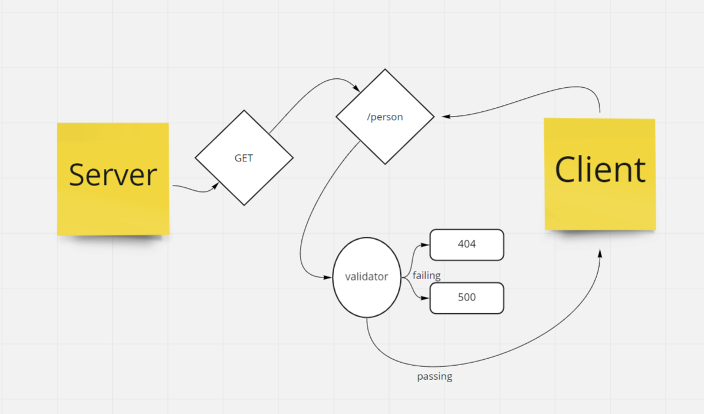

# Basic Express Server

Author: Katy Roffe

## Installation

* `npm install dotenv express jest`

## Problem Domain

* To create and deploy a standards compliant Express server prior to bringing in an API.

## Deployment Link
[Heroku Link](https://kroffe-basic-express-server.herokuapp.com/)\
[Original PR Link for grading purposes](https://github.com/KatyRoffe/basic-express-server/pull/1)

## UML

## Routes

* HTTP Get
  * Path: /person
  * this path should respond to a query request by presenting the name in a string provided by the request
